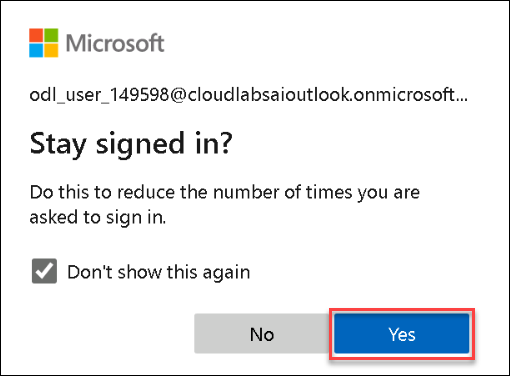

## Introduction

Azure Storage is Microsoft's cloud storage solution for modern data storage scenarios. Azure Storage offers a massively scalable object store for data objects, a file system service for the cloud, a messaging store for reliable messaging, and a NoSQL store. Azure Storage is:

* **Durable and highly available** Redundancy ensures that your data is safe in the event of transient hardware failures. You can also opt to replicate data across datacenters or geographical regions for additional protection from local catastrophe or natural disaster. Data replicated in this way remains highly available in the event of an unexpected outage.
* **Secure** All data written to Azure Storage is encrypted by the service. Azure Storage provides you with fine-grained control over who has access to your data.
* **Scalable** Azure Storage is designed to be massively scalable to meet the data storage and performance needs of today's applications.
* **Managed** Microsoft Azure handles hardware maintenance, updates, and critical issues for you.
* **Accessible** Data in Azure Storage is accessible from anywhere in the world over HTTP or HTTPS. Microsoft provides client libraries for Azure Storage in a variety of languages, including .NET, Java, Node.js, Python, PHP, Ruby, Go, and others, as well as a mature REST API. Azure Storage supports scripting in Azure PowerShell or Azure CLI. And the Azure portal and Azure Storage Explorer offer easy visual solutions for working with your data.

### Find Azure Credentials on Environment Details

1. Once registration is accepted and Launched the Lab, It will be automatically redirected to the lab activation page. Find the Azure Credetial on Environment Details page under Azure Credentials section.
  
  
### Login to Azure Portal

1. Login to Azure Portal using the Azure Username and Password. You can navigate to ```https://portal.azure.com/```, in this lab click on the **Azure Portal** shortcut added to the Desktop of lab virtual machine which is auto logged in on left hand side. It will take you to the Azure portal after accepting the default values of the Edge browser. 
  
  
1. Get the Azure Username and Password from Environment Details page, you can use the copy icon to copy the values. First enter the username on Signin page and click on Next button. On the next page enter the Azure Password and click on the **Sign in**.

   
 
1. You will get the ```Stay signed in?``` page, check the checkbox and then click on **Yes**.

   
 
1. You will get ```Welcome to Microsoft Azure``` popup. Click on **Maybe later**.

   
