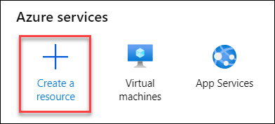
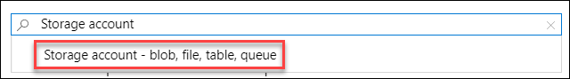
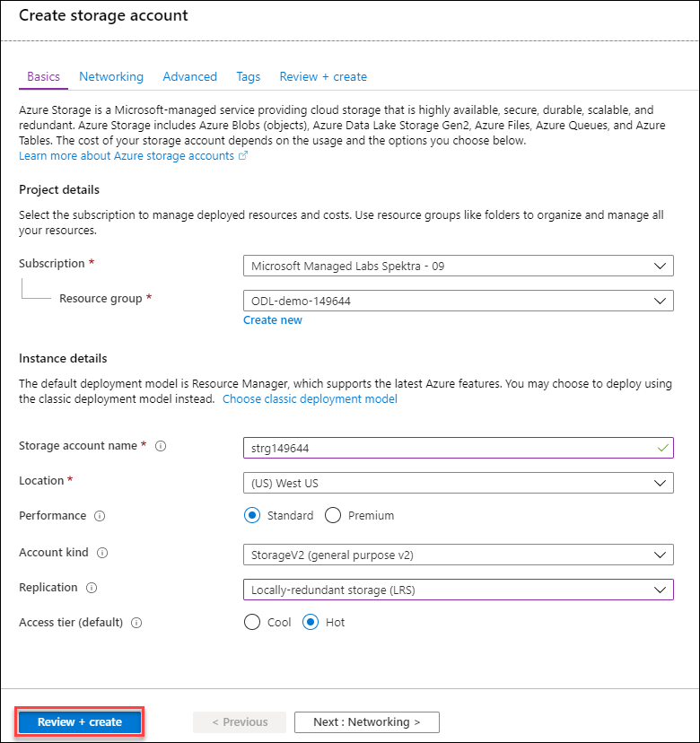

# Create a storage account using Azure portal

1. On the Azure portal menu or from the **Home** page, select **Create a resource**.

    
    
2. Select **Storage account** under **Azure Marketplace**.
 
    
 
3. Provide the following values for the storage account and then click on **Review + Create**
    * Subscription : Select the existing Subscription. Leave it default if it is automatically selected.
    * Resource group: Select the existing Resource Group which looks like **az-011-149644**.
    * Location: Select the same location in which your lab RG ```az-011-149644``` is created.
    * Performance: **Standard**
    * Account Kind: **StorageV2 (general purpose v2)**
    * Replication: **Locally-redundant storage(LRS)**
    * Access tier: **Hot**
    
       
   


1. In the Subscription field, select the **subscription** in which to create the storage account
1. In the **Resource group** field, select an existing resource group which looks like **az-011-149644**
1. Enter a **Storage account name**. The name will be used to generate the public URL used to access the data in the account. The name must be unique across all existing storage account names in Azure. Names must be 3 to 24 characters long and can contain only lowercase letters and numbers.

1. In the **Location** field, select a location for the storage account, or use the default location.

1. Select Standard for the **Performance** option. This decides the type of disk storage used to hold the data in the Storage account.

1. Select StorageV2 (general purpose v2) for the **Account kind**. This provides access to the latest features and pricing. In particular, Blob storage accounts have more options available with this account type. You need a mix of blobs and a queue, so the Blob storage option will not work. For this application, there would be no benefit to choosing a Storage (general purpose v1) account, since that would limit the features you could access and would be unlikely to reduce the cost of your expected workload.

1. Select Locally-redundant storage (LRS) for the **Replication** option. Data in Azure storage accounts are always replicated to ensure high availability - this option lets you choose how far away the replication occurs to match your durability requirements.

1. Set the **Access tier** to Hot. This setting is only used for Blob storage. The **Hot Access Tier** is ideal for frequently accessed data, and the **Cool Access Tier** is better for infrequently accessed data.

The following screenshot shows the completed settings for the **Basics** tab. Note that the resource group, subscription, and name will have different values.

<br/>

      
# Configure the networking options

1. Click the **Next: Networking >** button to move to the **Networking** tab, or select the **Networking** tab at the top of the screen.
2. Set the **Connectivity** method option to **Public endpoint (all networks)**. This option allows you to isolate the storage account on an Azure virtual network. We want to use public Internet access. Our content is public facing and you need to allow access from public clients.

<br/>

If you plan to use **Azure Data Lake Storage**, choose the **Advanced tab**, and then set Hierarchical namespace to **Enabled**.

### Create

1. Click **Review + create** to review the settings. This will do a quick validation of your options to make sure all the required fields are selected. If there are issues, they'll be reported here. Once you've reviewed the settings.

Click **Create** to provision the storage account.

It will take a few minutes to deploy the account.
