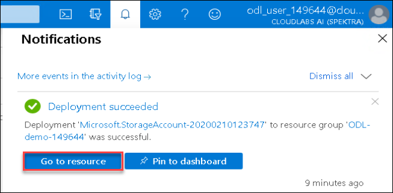
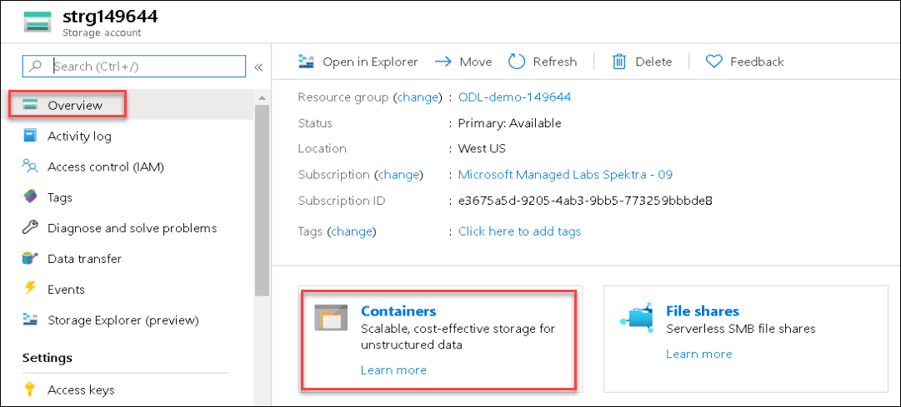

## Create a storage account using Azure portal

1. On the Azure portal menu or from the **Home** page, select **Create a resource**.

    
    
1. Select **Storage account** under **Azure Marketplace**.
 
    
 
1. Provide the following values for the storage account on the **Basics** tab and then click on **Review + Create**.
    * Subscription : Select the existing Subscription. Leave it default if it is automatically selected.
    * Resource group: Select the existing Resource Group which looks like **az-011-149644**.
    * Storage account name: **strg149644**, replace the 149644 with unique id, you can get it from your RG name. 
    * Location: Select the same location in which your lab RG ```az-011-149644``` is created.
    * Performance: **Standard**
    * Account Kind: **StorageV2 (general purpose v2)**
    * Replication: **Locally-redundant storage(LRS)**
    * Access tier: **Hot**
    
       
       
1. Review Basics, Networking and Advanced configuration and then click **Create** to provision the storage account.

    
    
It will take few minutes to deploy the storage account.

## Explore storage account

1. Once storage account is provision it will show the Notification. Click the notication icon 🔔 in upper right corner and then click **Go to resource**. It will navigate to the recently created storage account.

    
  
1. Click the Containers from Overview blade of teh storage account. 

    
   
1. Click on + Container

    
