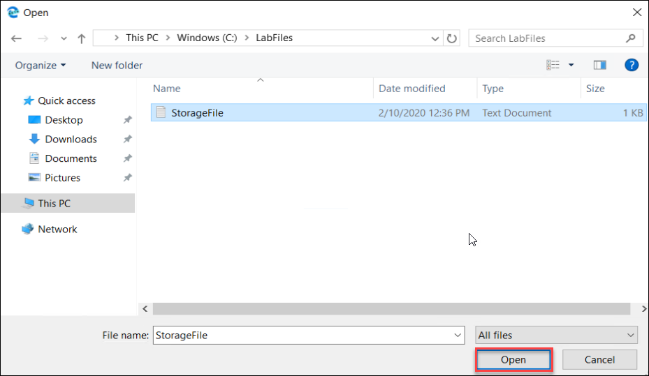
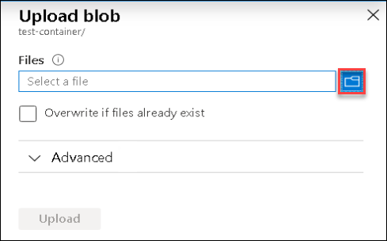
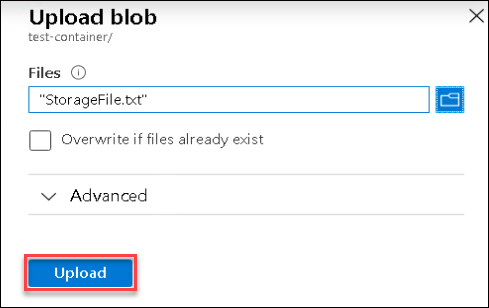
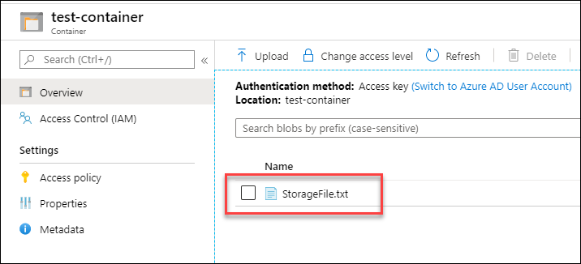
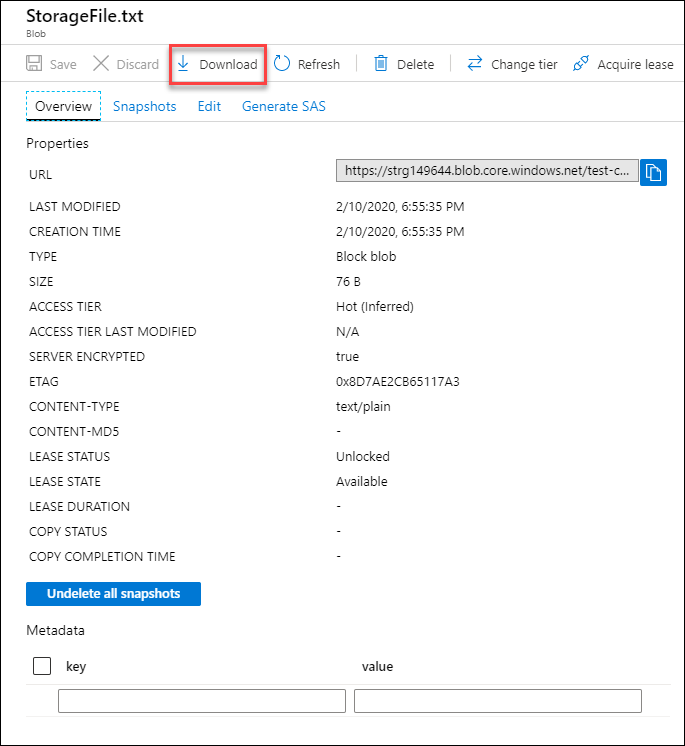

# Create a Container and Upload file

To create a container in the Azure portal, follow these steps:

1. Navigate to the storage account which you created in last step.
1. In the left menu for the storage account, scroll to the **Blob service** section, then select **Containers**.

    

1. Select the + **Container** button.

    

1. Enter following details for the container and click **OK** to create the container.
   
   * Name: **test-conatiner**
   * Public access level: **Container (anonymous read access for containers and blobs)**
      
      

## Upload a block blob

Block blobs consist of blocks of data assembled to make a blob. Most scenarios using Blob storage deploy block blobs. Block blobs are ideal for storing text and binary data in the cloud, like files, images, and videos. This quickstart shows how to work with block blobs.

To upload a block blob to your new container in the Azure portal, follow these steps:

1. In the Azure portal, navigate to the container you created in the previous section.
1. Select the container to show a list of blobs it contains. Since this container is new, it won't yet contain any blobs.
1. Select the **Upload** button to open the upload blade.
1. Click on the file icon to select a file from your virtual machine file system.

    

1. Browse your local file system, navigate to following path ```C:\LabFiles\``` and then select StorageFile.txt file to upload. Now, clcik on open.

    

1. Optionally, expand the advanced section to define other setting such as authentication type, access tier, or virtual folder path.
1. Select the **Upload** button to commit the upload.

    

## Download a block blob

You can download a block blob to display in the browser or save to your local file system. To download a block blob, follow these steps:

1. Navigate to the list of blobs that you uploaded in the previous section and select the ```StorageFile.txt``` blob.

    

2. Click the **Download** to download the blob file. You can download it in your virtual machine and verify it has the same content file which you uploaded earlier.

    
